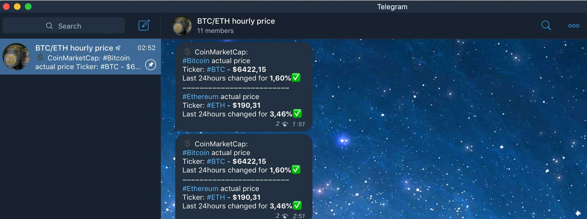

# info-bot-coin-bot-v2
This is a simple version of a Telegram Bot on Python, that sending a message to a TG channel with a price of a crypto coin you want, here is used Bitcoin (BTC) and Ethereum (ETH)

[@CryptoInfoMe](https://t.me/CryptoInfoMe "@CryptoInfoMe") - enjoy it!

Had been used:

+ [python-telegram-bot](https://github.com/python-telegram-bot/python-telegram-bot "python-telegram-bot API Library GitHub Repository") API Library, you can use *start_polling* or *webhook* updates methods to recieve the messages (see infobotcoinbot.py code and pyTelegramBotAPI Library manual)
* [Emoji Library](https://github.com/carpedm20/emoji "Emoji for Python.") to use unicode emojis
---

### Settings:
+ put the token of your bot at *TOKEN_BOT*
+ put your channel alias at *CHAT_ID*
+ choose your bot's run method *start_polling()* or *start_webhook()*
+ Add your bot to your telegram channel and make it an administrator to send  messages
---

Screenshot of the bot's work:

